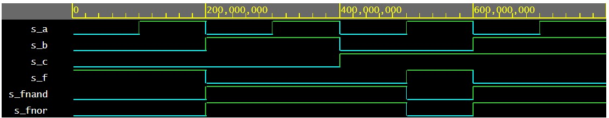
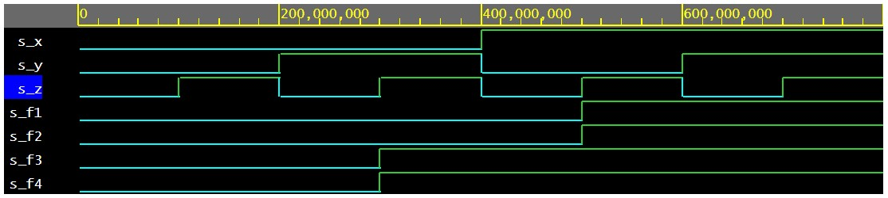

# Lab-01 gates
## GitHub
https://github.com/zvarmuzova/Digital-electronics-1

## De Morgan's laws

```
library ieee;               -- Standard library
use ieee.std_logic_1164.all;-- Package for data types and logic operations

------------------------------------------------------------------------
-- Entity declaration for basic gates
------------------------------------------------------------------------
entity gates is
    port(
        a_i    : in  std_logic;         -- Data input
        b_i    : in  std_logic;         -- Data input
        c_i		: in std_logic;			-- Data input
        f_o		: out std_logic;		-- output function
        fnand_o	: out std_logic;		-- NAND output function
        fnor_o	: out std_logic			-- NOR output function
        
        --for_o  : out std_logic;         -- OR output function
        --fand_o : out std_logic;         -- AND output function
        --fxor_o : out std_logic          -- XOR output function
    );
end entity gates;

------------------------------------------------------------------------
-- Architecture body for basic gates
------------------------------------------------------------------------
architecture dataflow of gates is
begin
    f_o		<= ((not b_i) and a_i) or ((not c_i) and (not b_i));
    fnand_o	<= (not(not(b_i) and (a_i)) and not(not(c_i) and not(b_i)));
    fnor_o	<= not(not((b_i) or not(a_i)) or not((c_i) or (b_i)));
    --for_o  <= a_i or b_i;
    --fand_o <= a_i and b_i;
    --fxor_o <= a_i xor b_i;

end architecture dataflow;
```

| **c** | **b** |**a** | **f(c,b,a)** | **fnand** | **fnor** |
| :-: | :-: | :-: | :-: | :-: | :-: |
| 0 | 0 | 0 | 1 | 0 | 0 |
| 0 | 0 | 1 | 1 | 0 | 0 |
| 0 | 1 | 0 | 0 | 1 | 1 |
| 0 | 1 | 1 | 0 | 1 | 1 |
| 1 | 0 | 0 | 0 | 1 | 1 |
| 1 | 0 | 1 | 1 | 0 | 0 |
| 1 | 1 | 0 | 0 | 1 | 1 |
| 1 | 1 | 1 | 0 | 1 | 1 |

[link to Eda Playground](https://www.edaplayground.com/x/8Lsy)



## Distributive laws
```
-- Code your design here
library IEEE;
use IEEE.std_logic_1164.all;

------------------------------------------------------------------------
-- Entity declaration for basic gates
------------------------------------------------------------------------
entity gates is
    port(
        x_i    : in  std_logic;         -- Data input
        y_i    : in  std_logic;         -- Data input
        z_i		: in std_logic;			-- Data input
        f1_o	: out std_logic;		-- function f1
        f2_o	: out std_logic;		-- function f2
        f3_o	: out std_logic;		-- function f3
        f4_o	: out std_logic			-- function f4
        
    );
end entity gates;

------------------------------------------------------------------------
-- Architecture body for basic gates
------------------------------------------------------------------------
architecture dataflow of gates is
begin
    f1_o	<= ((x_i and y_i) or (x_i and z_i));
    f2_o	<= ((x_i and (y_i or z_i)));
    f3_o	<= ((x_i or y_i) and (x_i or z_i));
    f4_o	<= (x_i or (y_i and z_i));

end architecture dataflow;
```

[link to Eda Playground](https://www.edaplayground.com/x/gG9E)

