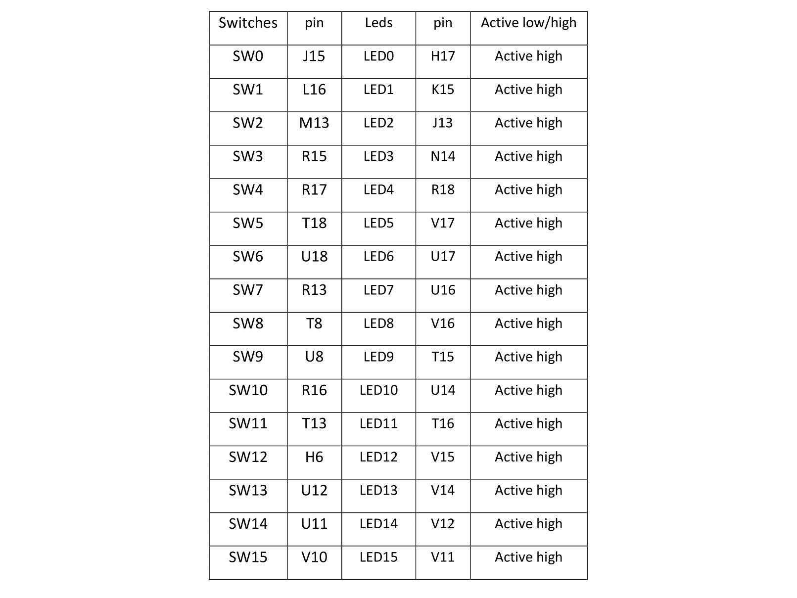
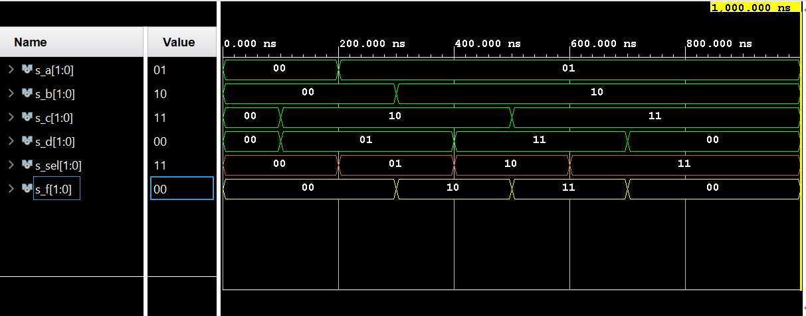
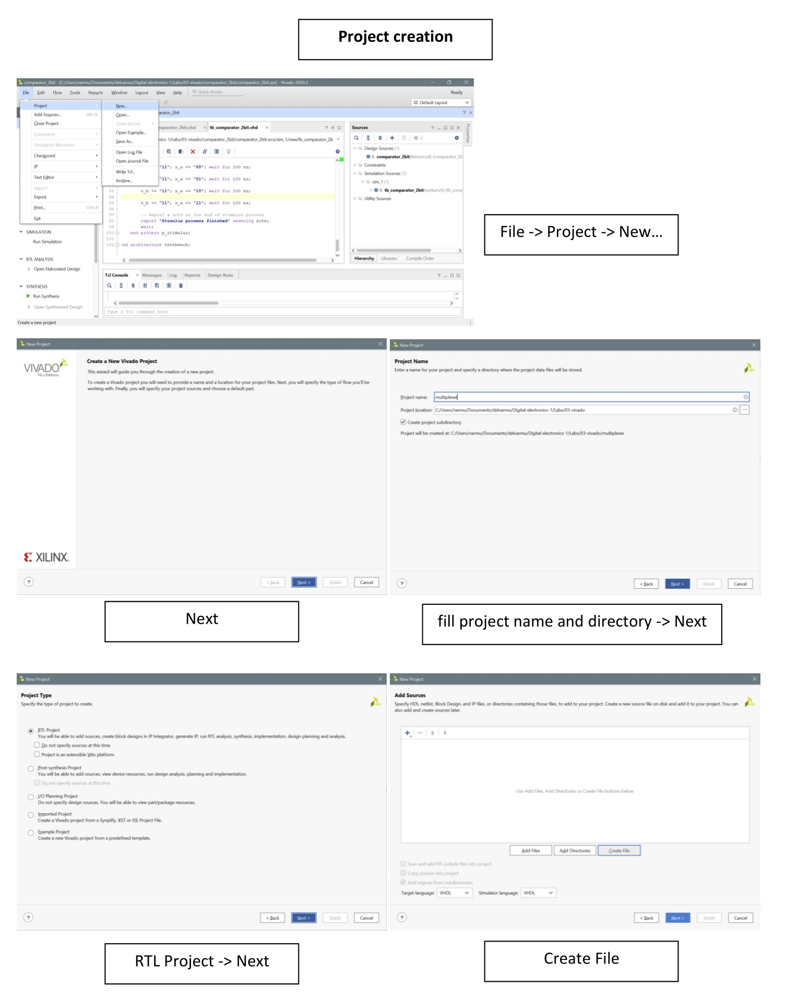
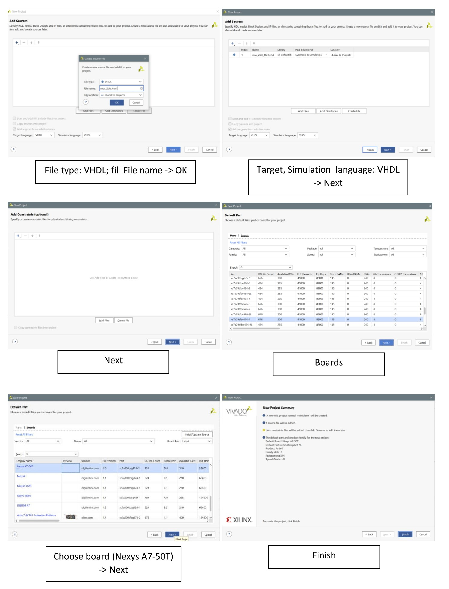
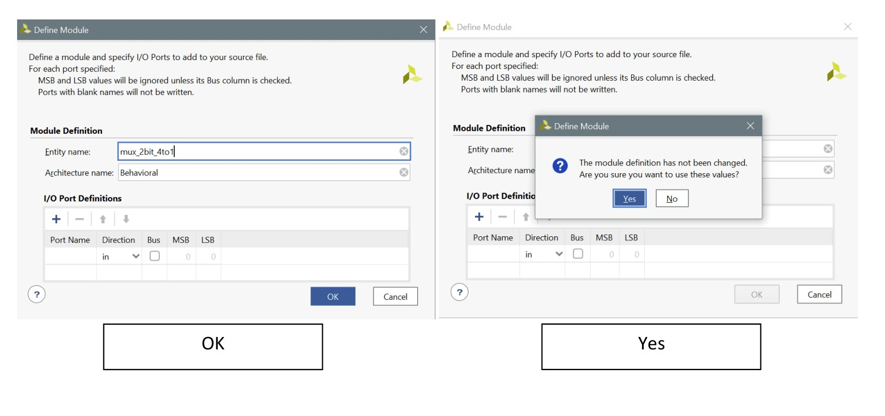
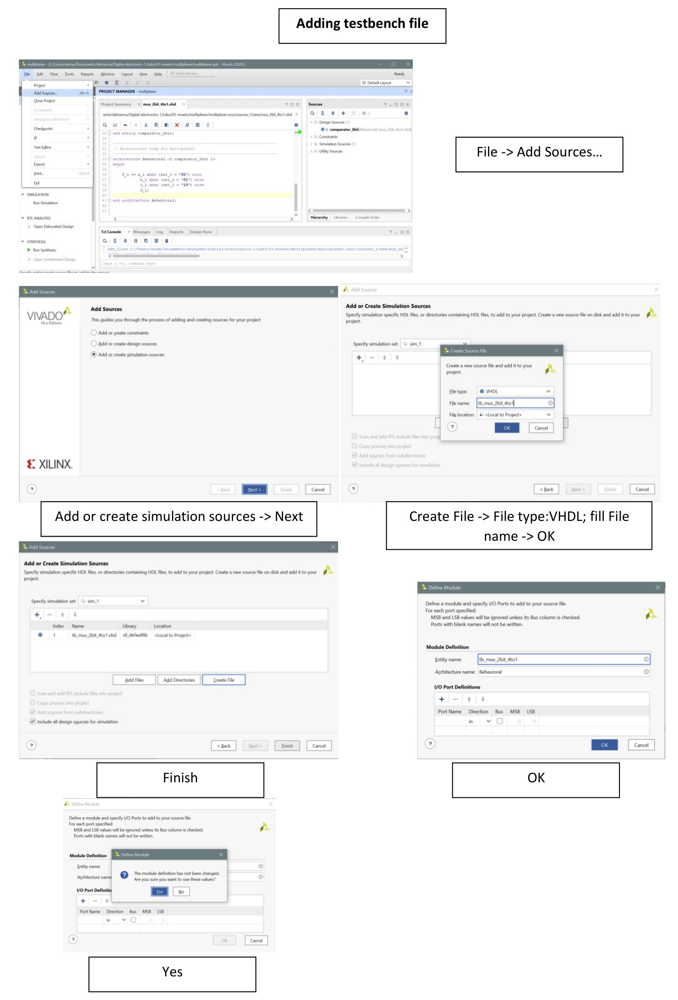
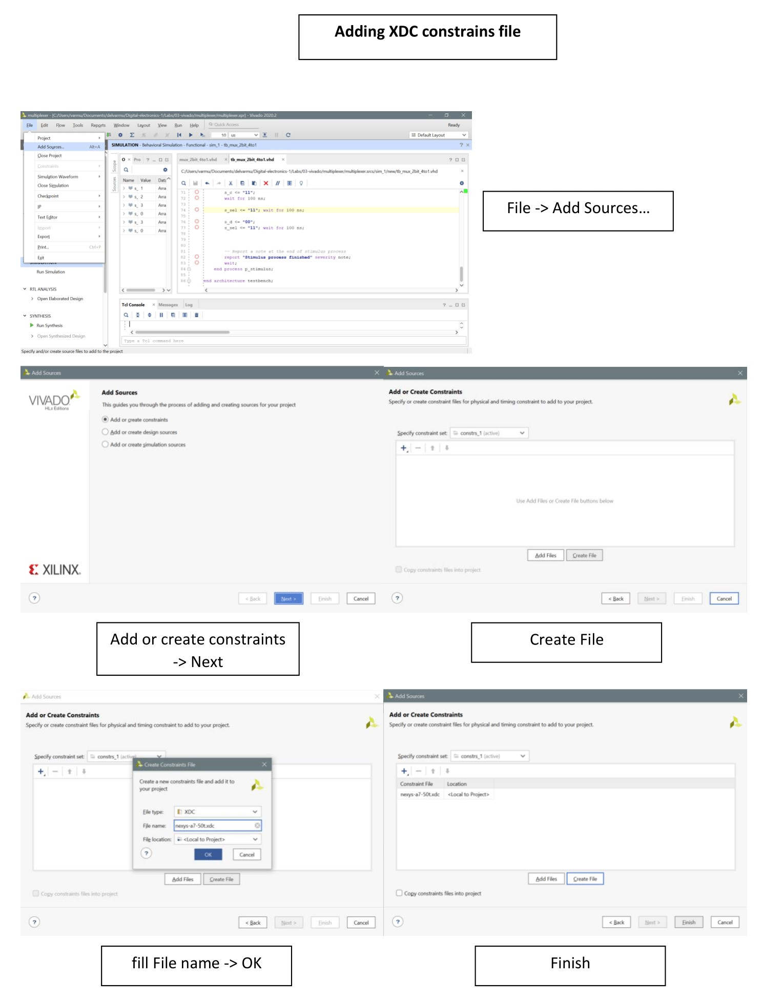
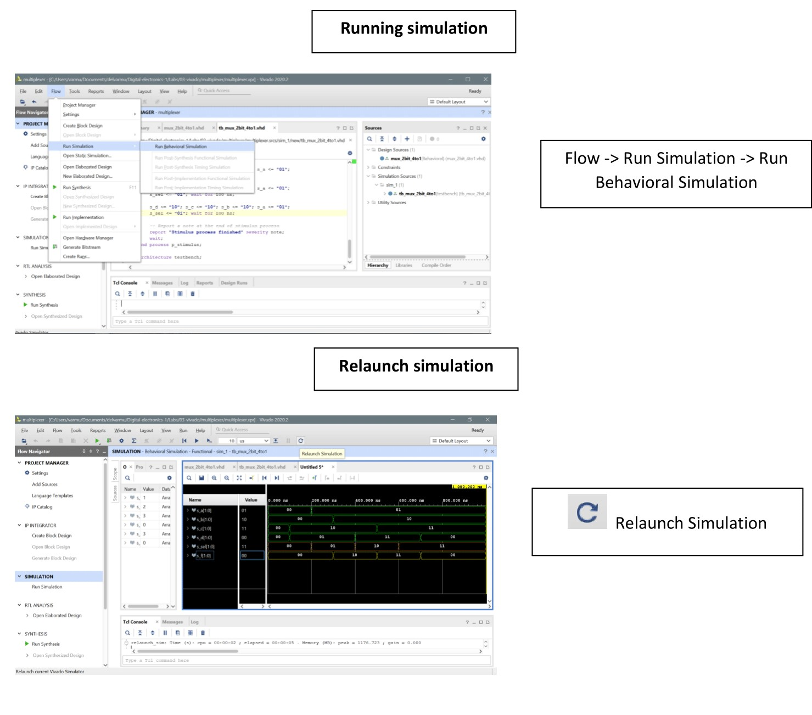

# Lab-03 vivado
## 1. Preparation tasks - Nexys A7 board


## 2. Two-bit wide 4-to-1 multiplexer
### mux_2bit_4to1.vhd - architecture
```vhdl
architecture Behavioral of mux_2bit_4to1 is
begin
    
    f_o <= a_i when (sel_i = "00") else
            b_i when (sel_i = "01") else
            c_i when (sel_i = "10") else
            d_i;

end architecture Behavioral;
```
### tb_mux_2bit_4to1.vhd - stimulus process
```vhdl
p_stimulus : process
    begin
        -- Report a note at the begining of stimulus process
        report "Stimulus process started" severity note;
        
        s_d <= "00"; s_c <= "00"; s_b <= "00"; s_a <= "00"; 
        s_sel <= "00"; wait for 100 ns;
        
        s_d <= "01"; s_c <= "10"; s_b <= "00"; s_a <= "00"; 
        s_sel <= "00"; wait for 100 ns;
        
        s_d <= "01"; s_c <= "10"; s_b <= "00"; s_a <= "01"; 
        s_sel <= "01"; wait for 100 ns;
        
        s_d <= "01"; s_c <= "10"; s_b <= "10"; s_a <= "01"; 
        s_sel <= "01"; wait for 100 ns;
        
        s_d <= "11"; s_c <= "10"; s_b <= "10"; s_a <= "01"; 
        s_sel <= "10"; wait for 100 ns;
        
        s_c <= "11";
        wait for 100 ns;
        
        s_sel <= "11"; wait for 100 ns;
        
        s_d <= "00";
        s_sel <= "11"; wait for 100 ns;
        
        -- Report a note at the end of stimulus process
        report "Stimulus process finished" severity note;
        wait;
    end process p_stimulus;
```
### time waveforms


## 3. Vivado tutorial
### Creating a project




### Adding testbench file


### Adding XDC constrains file


### Running simulation


