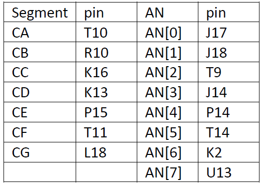
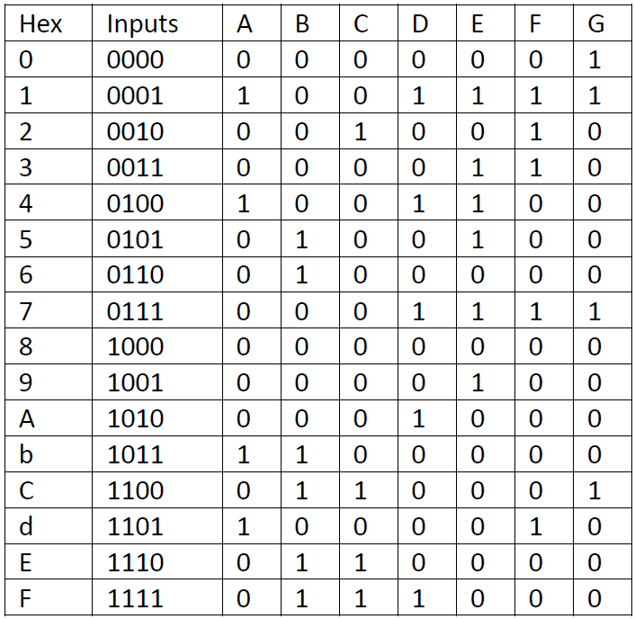
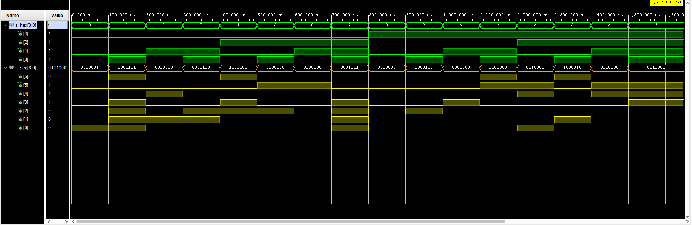
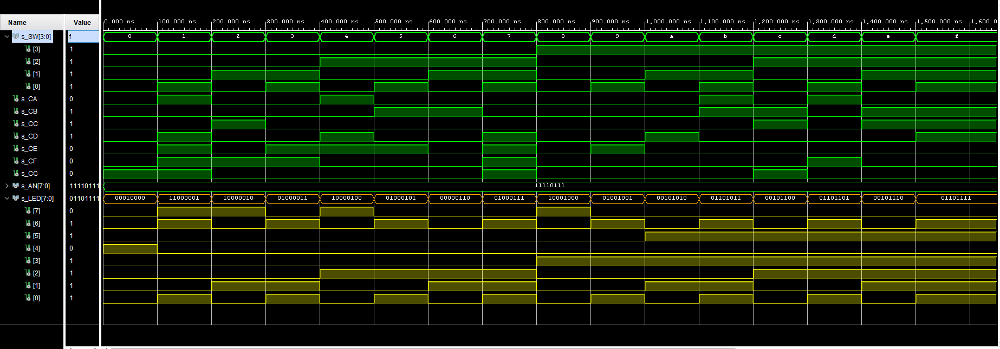

# Lab-04 segment
## 1. Preparation tasks 

### Table with conection of 7-segment displays on Nexys A7 board


### Decoder truth table for common anode 7-segment display.


## 2. Seven-segment display decoder
### Architecture from source file hex_7seg.vhd
```vhdl
------------------------------------------------------------------------
-- Architecture body for 7 segment display
------------------------------------------------------------------------
architecture Behavioral of hex_7seg is
begin
    
    p_7seg_decoder : process(hex_i)
    begin
        case hex_i is
            when "0000" =>
                seg_o <= "0000001";      -- 0
            when "0001" =>
                seg_o <= "1001111";      -- 1
            when "0010" =>
                seg_o <= "0010010";      -- 2
            when "0011" =>
                seg_o <= "0000110";      -- 3
            when "0100" =>
                seg_o <= "1001100";      -- 4
            when "0101" =>
                seg_o <= "0100100";      -- 5
            when "0110" =>
                seg_o <= "0100000";      -- 6
            when "0111" =>
                seg_o <= "0001111";      -- 7
            when "1000" =>
                seg_o <= "0000000";      -- 8
            when "1001" =>
                seg_o <= "0000100";      -- 9
            when "1010" =>
                seg_o <= "0001000";      -- A
            when "1011" =>
                seg_o <= "1100000";      -- b
            when "1100" =>
                seg_o <= "0110001";      -- C
            when "1101" =>
                seg_o <= "1000010";      -- d
            when "1110" =>
                seg_o <= "0110000";      -- E
            when others =>
                seg_o <= "0111000";      -- F
        end case;
     end process p_7seg_decoder;
                
end architecture Behavioral;
```
### Stimulus process from testbench file tb_hex_7seg.vhd
```vhdl
p_stimulus : process
    begin
        -- Report a note at the begining of stimulus process
        report "Stimulus process started" severity note;
        
        s_hex <= "0000";  wait for 100 ns;       -- 0
        s_hex <= "0001";  wait for 100 ns;       -- 1
        s_hex <= "0010";  wait for 100 ns;       -- 2
        s_hex <= "0011";  wait for 100 ns;       -- 3
        s_hex <= "0100";  wait for 100 ns;       -- 4
        s_hex <= "0101";  wait for 100 ns;       -- 5
        s_hex <= "0110";  wait for 100 ns;       -- 6
        s_hex <= "0111";  wait for 100 ns;       -- 7
        s_hex <= "1000";  wait for 100 ns;       -- 8
        s_hex <= "1001";  wait for 100 ns;       -- 9
        s_hex <= "1010";  wait for 100 ns;       -- A
        s_hex <= "1011";  wait for 100 ns;       -- b
        s_hex <= "1100";  wait for 100 ns;       -- C
        s_hex <= "1101";  wait for 100 ns;       -- d
        s_hex <= "1110";  wait for 100 ns;       -- E
        s_hex <= "1111";  wait for 100 ns;       -- F
                
        
        -- Report a note at the end of stimulus process
        report "Stimulus process finished" severity note;
        wait;
    end process p_stimulus;
```
### Simulated time waveforms


### Code from source file top.vhd with 7-segment module instalation
```vhdl
hex2seg : entity work.hex_7seg
        port map(
            hex_i    => SW,
            seg_o(6) => CA,
            seg_o(5) => CB,
            seg_o(4) => CC,
            seg_o(3) => CD,
            seg_o(2) => CE,
            seg_o(1) => CF,
            seg_o(0) => CG
        );
```

## 3. LED(7:4) indicators
### Truth table and listing of code
.png)

```vhdl
-- LED(7:4) indicators
    
    -- Turn LED(4) on if input value is equal to 0, ie "0000"
    LED(4) <= '1' when (SW <= "0000") else '0';
    
    -- Turn LED(5) on if input value is greater than "1001", ie 9
    LED(5) <= '1' when (SW > "1001") else '0';
    
    -- Turn LED(6) on if input value is odd, ie 1, 3, 5, ...
    process(SW)
    begin
        case SW is
            when "0001" =>      LED(6) <= '1';      --1
            when "0011" =>      LED(6) <= '1';      --3
            when "0101" =>      LED(6) <= '1';      --5
            when "0111" =>      LED(6) <= '1';      --7
            when "1001" =>      LED(6) <= '1';      --9
            when "1011" =>      LED(6) <= '1';      --11
            when "1101" =>      LED(6) <= '1';      --13
            when "1111" =>      LED(6) <= '1';      --15
            when others =>      LED(6) <= '0';
            
        end case;
    end process;
    
    -- Turn LED(7) on if input value is a power of two, ie 1, 2, 4, or 8
    process(SW)
    begin
        case SW is
            when "0001" =>      LED(6) <= '1';      --1
            when "0010" =>      LED(6) <= '1';      --2
            when "0100" =>      LED(6) <= '1';      --4
            when "1000" =>      LED(6) <= '1';      --8
            when others =>      LED(6) <= '0';
            
        end case;
    end process;

```
### Simulated time waveforms
