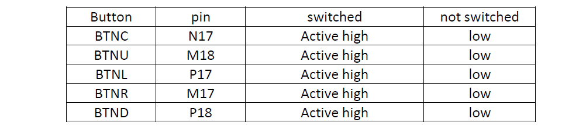

# Lab-05 counter
## 1. Preparation tasks 
### Table with connection of push buttons on Nexys A7


### Table with calculated vulues


## 2. Bidirectional counter
### Process of `_cnt_up_down`
```vhdl
p_cnt_up_down : process(clk)
    begin
        if rising_edge(clk) then
        
            if (reset = '1') then               -- Synchronous reset
                s_cnt_local <= (others => '0'); -- Clear all bits

            elsif (en_i = '1') then       -- Test if counter is enabled


                -- TEST COUNTER DIRECTION HERE
                if (cnt_up_i = '1') then
                    s_cnt_local <= s_cnt_local + 1;
                elsif (cnt_up_i = '0') then
                    s_cnt_local <= s_cnt_local - 1;
                end if;

            end if;
        end if;
    end process p_cnt_up_down;
```
### Reset and stimulus processes from testbench file `tb_cnt_up_down.vhd` with asserts
```vhdl
 p_reset_gen : process
    begin
        s_reset <= '0';
        wait for 7 ns;
        
        -- Reset activated
        s_reset <= '1';
        wait for 28 ns;

        s_reset <= '0';
        wait;
    end process p_reset_gen;

    p_stimulus : process
    begin
        report "Stimulus process started" severity note;

        -- Enable counting
        s_en     <= '1';
        
        -- Change counter direction
        s_cnt_up <= '1';
        wait for 380 ns;
        s_cnt_up <= '0';
        wait for 220 ns;

        -- Disable counting
        s_en     <= '0';

        report "Stimulus process finished" severity note;
        wait;
    end process p_stimulus;
```
### Simulated time waveforms


## 3. Top level
### Source file `top.vhd`
```vhdl

    --------------------------------------------------------------------
    -- Instance (copy) of clock_enable entity
    clk_en0 : entity work.clock_enable
        generic map(
            --- WRITE YOUR CODE HERE
            g_MAX => 100000000
        )
        port map(
            --- WRITE YOUR CODE HERE
            clk     =>  CLK100MHZ,
            reset   =>  BTNC,
            ce_o    =>  s_en
        );

    --------------------------------------------------------------------
    -- Instance (copy) of cnt_up_down entity
    bin_cnt0 : entity work.cnt_up_down
        generic map(
            --- WRITE YOUR CODE HERE
            g_CNT_WIDTH => 4
        )
        port map(
            --- WRITE YOUR CODE HERE
            clk      => CLK100MHZ,
            reset    => BTNC,
            en_i     => s_en,
            cnt_up_i => SW(0),
            cnt_o    => s_cnt
        );

    -- Display input value on LEDs
    LED(3 downto 0) <= s_cnt;

    --------------------------------------------------------------------
    -- Instance (copy) of hex_7seg entity
    hex2seg : entity work.hex_7seg
        port map(
            hex_i    => s_cnt,
            seg_o(6) => CA,
            seg_o(5) => CB,
            seg_o(4) => CC,
            seg_o(3) => CD,
            seg_o(2) => CE,
            seg_o(1) => CF,
            seg_o(0) => CG
        );

```
### Top layer with both counters
