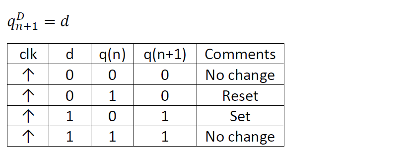
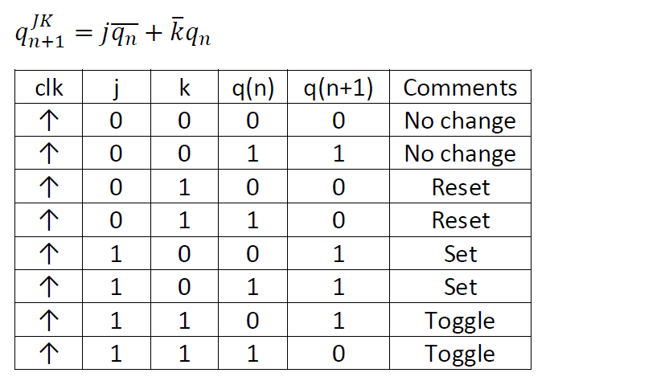
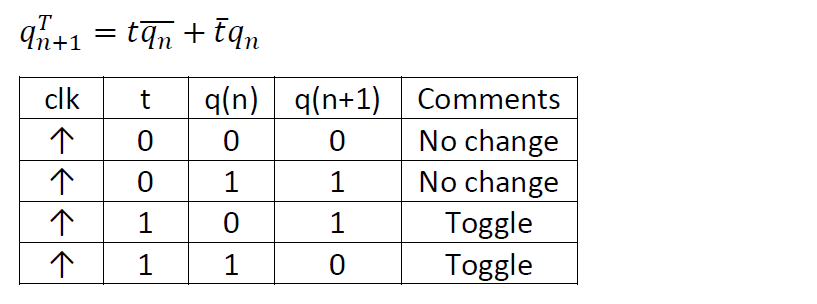
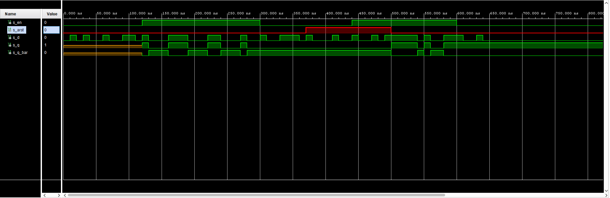
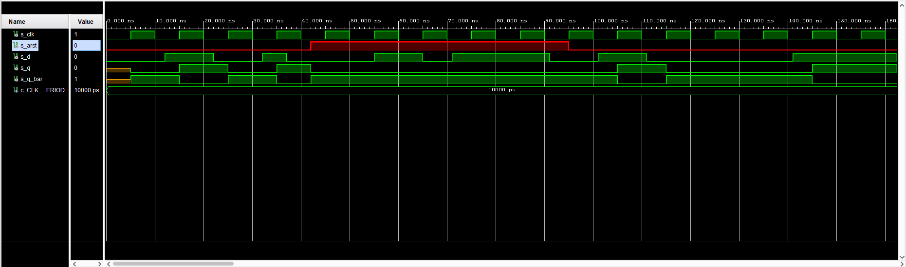
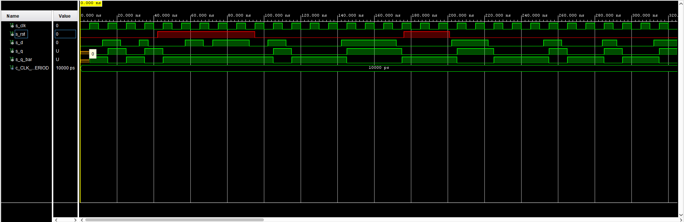
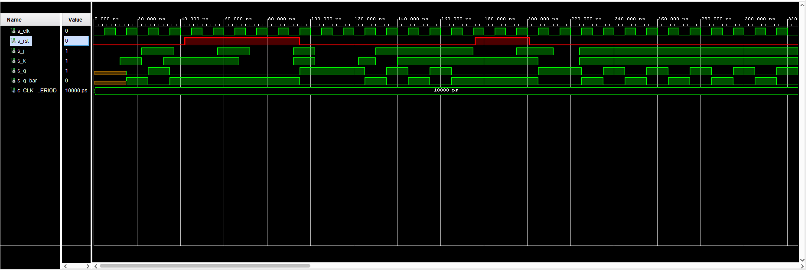
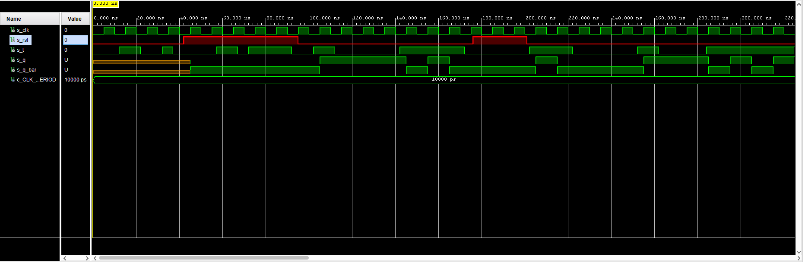
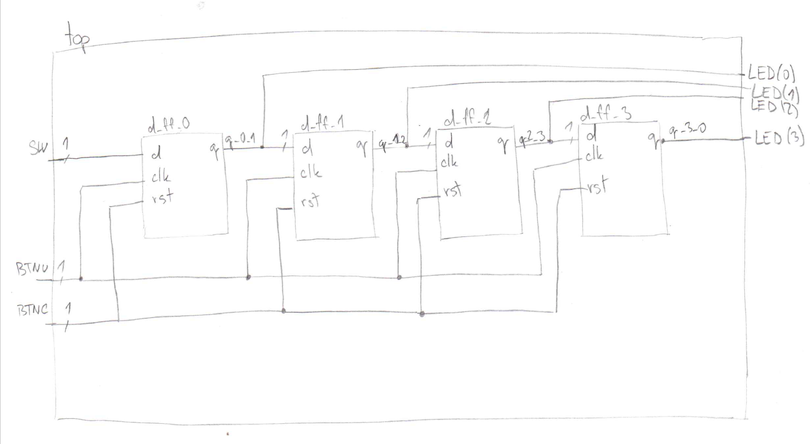

# Lab-06 counter
## 1. Preparation tasks 
### Characteristic eqautions and completed tables for D, JK, T flip-flops





## 2. D latch
### Process of `p_d_latch`
```vhdl
 p_d_latch : process (d, arst, en)
        begin
            if (arst = '1') then
                q <= '0';
                q_bar <= '1';
            elsif (en = '1') then
                q <= d;
                q_bar <= not d;
            end if;
                
        end process p_d_latch;
```
### Reset and stimulus processes from the testbench file `tb_d_latch.vhd`
```vhdl
 p_stimulus : process
    begin
        report "Stimulus process started" severity note;
        
        -- reset included in stimulus process
        s_en <= '0';
        s_arst <= '0';
        s_d <= '0';
        
        wait for 10 ns;
        
        s_d <= '1';
        wait for 10 ns;
        s_d <= '0';
        wait for 10 ns;
        s_d <= '1';
        wait for 10 ns;
        s_d <= '0';
        wait for 20 ns;
        s_d <= '1';
        wait for 10 ns;
        s_d <= '0';
        wait for 20 ns;
        s_d <= '1';
        wait for 20 ns;
        s_d <= '0';
        wait for 10 ns;
        
        s_en <= '1';
        s_d <= '1';
        wait for 2 ns;
        assert ((s_q = '1') and (s_q_bar = '0'))
        report "Test failed for input combination d = 1, en = 1, arst = 0." severity error;
         wait for 8 ns;
        s_d <= '0';
        wait for 2 ns;
        assert ((s_q = '0') and (s_q_bar = '1'))
        report "Test failed for input combination d = 0, en = 1, arst = 0." severity error;
        wait for 28 ns;
        s_d <= '1';
        wait for 30 ns;
        s_d <= '0';
        wait for 30 ns;
        s_d <= '1';
        wait for 20 ns;
        s_d <= '0';
        wait for 30 ns;
        s_d <= '1';
        wait for 10 ns;
        s_d <= '0';
        wait for 20 ns;
        
        s_en <= '0';
        wait for 2 ns;
        assert ((s_q = '0') and (s_q_bar = '1'))
        report "Test failed for input combination d = 0, en = 0, arst = 0." severity error;
        s_d <= '1';
        wait for 8 ns;
        s_d <= '0';
        wait for 20 ns;
        s_d <= '1';
        wait for 30 ns;
        s_d <= '0';
        wait for 10 ns;
        
        s_arst <= '1';
        s_d <= '1';
        wait for 2 ns;
        assert ((s_q = '0') and (s_q_bar = '1'))
        report "Test failed for input combination d = 0, en = 0, arst = 1." severity error;
        wait for 8 ns;
        s_d <= '0';
        wait for 30 ns;
        s_d <= '1';
        wait for 10 ns;
        s_d <= '0';
        wait for 20 ns;
        
        s_en <= '1';
        s_d <= '1';
        wait for 2 ns;
        assert ((s_q = '0') and (s_q_bar = '1'))
        report "Test failed for input combination d = 1, en = 1, arst = 1." severity error;
        wait for 8 ns;
        s_d <= '0';
        wait for 20 ns;
        s_d <= '1';
        wait for 10 ns;
        s_d <= '0';
        wait for 2 ns;
        assert ((s_q = '0') and (s_q_bar = '1'))
        report "Test failed for input combination d = 0, en = 1, arst = 1." severity error;
        wait for 8 ns;
        s_d <= '1';
        wait for 10 ns;
        
        s_arst <= '0';
        wait for 40 ns;
        s_d <= '0';
        wait for 10 ns;
        s_d <= '1';
        wait for 10 ns;
        s_d <= '0';
        wait for 20 ns;
        s_d <= '1';
        wait for 20 ns;
        
        s_en <= '0';
        wait for 10 ns;
        s_d <= '0';
        wait for 20 ns;
        s_d <= '1';
        wait for 10 ns;
        s_d <= '0';
        wait for 10 ns;
        
        
        report "Stimulus process finished" severity note;
        wait;
    end process p_stimulus;
```
### Simulated time waveforms



## 3. Flip-flops
### Process of `p_d_ff_arst`, `p_d_ff_rst`,`p_jk_ff_rst`,`p_t_ff_rst`,
#### `p_d_ff_arst`
```vhdl
p_d_ff_arst : process (clk, arst)
        begin
            if (arst = '1') then
                q <= '0';
                q_bar <= '1';
                
            elsif rising_edge(clk) then
                q <= d;
                q_bar <= not d;
            end if;
                
        end process p_d_ff_arst;
```
#### `p_d_ff_rst`
```vhdl
p_d_ff_rst : process (clk)
        begin
            if rising_edge(clk) then
                if (rst = '1') then
                    s_q <= '0';
                else
                    if (d = '0') then
                        s_q <= '0';
                    elsif (d = '1') then
                        s_q <= '1';
                    end if;
                end if;
            end if;
                
        end process p_d_ff_rst;

        q      <= s_q;
        q_bar  <= not s_q;
```
#### `p_jk_ff_rst`
```vhdl
    p_jk_ff_rst : process (clk)
        begin
            if rising_edge(clk) then
                if (rst = '1') then
                    s_q <= '0';
                else
                    if (j = '0' and k = '0') then
                        s_q <= s_q;
                    elsif (j = '0' and k = '1') then
                        s_q <= '0';
                    elsif (j = '1' and k = '0') then
                        s_q <= '1';
                    elsif (j = '1' and k = '1') then
                        s_q <= not s_q;
                    end if;
                end if;
            end if;
                
        end process p_jk_ff_rst;

        q      <= s_q;
        q_bar  <= not s_q;
```
#### `p_t_ff_rst`
```vhdl
p_t_ff_rst : process (clk)
        begin
            if rising_edge(clk) then
                if (rst = '1') then
                    s_q <= '0';
                else
                    if (t = '0') then
                        s_q <= s_q;
                    elsif (t = '1') then
                        s_q <= not s_q;
                    end if;
                end if;
            end if;
                
        end process p_t_ff_rst;

        q      <= s_q;
        q_bar  <= not s_q;
```
### Clock, reset and stimulus processes from the testbench files with asserts
#### `tb_d_ff_arst`
```vhdl
    p_clk_gen : process
    begin
        while now < 750 ns loop         -- 75 periods of 100MHz clock
            s_clk <= '0';
            wait for c_CLK_100MHZ_PERIOD / 2;
            s_clk <= '1';
            wait for c_CLK_100MHZ_PERIOD / 2;
        end loop;
        wait;
    end process p_clk_gen;

    p_reset_gen : process
    begin
        s_arst <= '0';
        wait for 42 ns;
        
        -- Reset activated
        s_arst <= '1';
        wait for 53 ns;

        -- Reset deactivated
        s_arst <= '0';

        wait;
    end process p_reset_gen;
    
    p_stimulus : process
    begin
        report "Stimulus process started" severity note;

        s_d <= '0';
        wait for 12 ns;
        s_d <= '1';
        wait for 2 ns;
        assert ((s_q = '0') and (s_q_bar = '1'))
        report "Test failed for input combination d = 1, clk = 0, arst = 0." severity error;    --14 ns
        wait for 2 ns;
        assert ((s_q = '1') and (s_q_bar = '0'))
        report "Test failed for input combination d = 1, clk = 1, arst = 0." severity error;    -- 16 ns
        wait for 6 ns;
        s_d <= '0';
        wait for 4 ns;
        assert ((s_q = '0') and (s_q_bar = '1'))
        report "Test failed for input combination d = 0, clk = 1, arst = 0." severity error;    -- 26 ns
        wait for 6 ns;
        s_d <= '1';
        wait for 5 ns;
        s_d <= '0';
        wait for 2 ns;
        assert ((s_q = '1') and (s_q_bar = '0'))
        report "Test failed for input combination d = 0, clk = 1, arst = 0." severity error;    -- 39 ns
        wait for 4 ns;
        assert ((s_q = '0') and (s_q_bar = '1'))
        report "Test failed for input combination d = 0, clk = 0, arst = 1." severity error;    -- 43 ns
        wait for 12 ns;
        s_d <= '1';
        wait for 10 ns;
        s_d <= '0';
        wait for 6 ns;
        s_d <= '1';
        wait for 20 ns;
        s_d <= '0';
        wait for 10 ns;
        
        s_d <= '1';
        wait for 2 ns;
        
        wait for 8 ns;
        s_d <= '0';
        wait for 2 ns;
        wait for 28 ns;
        s_d <= '1';
        wait for 30 ns;
        s_d <= '0';
        wait for 30 ns;
        s_d <= '1';
        wait for 20 ns;
        s_d <= '0';
        wait for 30 ns;
        s_d <= '1';
        wait for 10 ns;
        s_d <= '0';
        wait for 20 ns;
        
        wait for 2 ns;
        s_d <= '1';
        wait for 8 ns;
        s_d <= '0';
        wait for 20 ns;
        s_d <= '1';
        wait for 30 ns;
        s_d <= '0';
        wait for 10 ns;
        
        
        report "Stimulus process finished" severity note;
        wait;
    end process p_stimulus;
```
#### `tb_d_ff_rst`
```vhdl
    p_clk_gen : process
    begin
        while now < 750 ns loop         -- 75 periods of 100MHz clock
            s_clk <= '0';
            wait for c_CLK_100MHZ_PERIOD / 2;
            s_clk <= '1';
            wait for c_CLK_100MHZ_PERIOD / 2;
        end loop;
        wait;
    end process p_clk_gen;

    p_reset_gen : process
    begin
        s_rst <= '0';
        wait for 42 ns;
        
        -- Reset activated
        s_rst <= '1';
        wait for 53 ns;

        -- Reset deactivated
        s_rst <= '0';

        wait for 81 ns;
        
        s_rst <= '1';
        wait for 25 ns;

        s_rst <= '0';
        wait;
    end process p_reset_gen;
    
    p_stimulus : process
    begin
        report "Stimulus process started" severity note;

        s_d <= '0';
        wait for 12 ns;
        s_d <= '1';
        wait for 10 ns;
        s_d <= '0';
        wait for 10 ns;
        s_d <= '1';
        wait for 5 ns;
        s_d <= '0';
        wait for 20 ns;
        s_d <= '1';
        wait for 10 ns;
        s_d <= '0';
        wait for 5 ns;
        s_d <= '1';
        wait for 20 ns;
        s_d <= '0';
        wait for 10 ns;
        
        s_d <= '1';
        wait for 2 ns;
        
        wait for 8 ns;
        s_d <= '0';
        wait for 2 ns;
        wait for 28 ns;
        s_d <= '1';
        wait for 30 ns;
        s_d <= '0';
        wait for 30 ns;
        s_d <= '1';
        wait for 20 ns;
        s_d <= '0';
        wait for 30 ns;
        s_d <= '1';
        wait for 10 ns;
        s_d <= '0';
        wait for 20 ns;
        
        wait for 2 ns;
        s_d <= '1';
        wait for 8 ns;
        s_d <= '0';
        wait for 20 ns;
        s_d <= '1';
        wait for 30 ns;
        s_d <= '0';
        wait for 10 ns;
        
        
        report "Stimulus process finished" severity note;
        wait;
    end process p_stimulus;
    
    p_asserts : process
    begin
        wait for 13 ns;
        assert ((s_q = '0') and (s_q_bar = '1'))
        report "Test failed for input combination d = 1, clk = 0, rst = 0." severity error;     --13 ns
        wait for 4 ns;
        assert ((s_q = '1') and (s_q_bar = '0'))
        report "Test failed for input combination d = 1, clk = 1, rst = 0." severity error;     -- 17 ns
        wait for 7 ns;
        assert ((s_q = '1') and (s_q_bar = '0'))
        report "Test failed for input combination d = 0, clk = 0, rst = 0." severity error;     -- 24 ns
        wait for 2 ns;
        assert ((s_q = '0') and (s_q_bar = '1'))
        report "Test failed for input combination d = 0, clk = 1, rst = 0." severity error;     -- 26 ns
        wait for 32 ns;        
        assert ((s_q = '0') and (s_q_bar = '1'))
        report "Test failed for input combination d = 1, clk = 1, rst = 1." severity error;     -- 58 ns
        
        wait;
    end process p_asserts;
```
#### `tb_jk_ff_rst`
```vhdl
    p_clk_gen : process
    begin
        while now < 750 ns loop         -- 75 periods of 100MHz clock
            s_clk <= '0';
            wait for c_CLK_100MHZ_PERIOD / 2;
            s_clk <= '1';
            wait for c_CLK_100MHZ_PERIOD / 2;
        end loop;
        wait;
    end process p_clk_gen;

    p_reset_gen : process
    begin
        s_rst <= '0';
        wait for 42 ns;
        
        -- Reset activated
        s_rst <= '1';
        wait for 53 ns;

        -- Reset deactivated
        s_rst <= '0';

        wait for 81 ns;
        
        s_rst <= '1';
        wait for 25 ns;

        s_rst <= '0';
        wait;
    end process p_reset_gen;
    
    p_stimulus : process
    begin
        report "Stimulus process started" severity note;

        s_j <= '0'; s_k <= '0';
        wait for 12 ns;
        s_k <= '1';
        wait for 10 ns;
        s_j <= '1'; s_k <= '0';
        wait for 10 ns;
        s_k <= '1';
        wait for 5 ns;
        s_j <= '0';
        wait for 20 ns;
        s_j <= '1';
        wait for 10 ns;
        s_k <= '0';
        wait for 5 ns;
        s_j <= '0';
        wait for 20 ns;
        s_j <= '1'; s_k <= '1';
        wait for 10 ns;
        
        s_j <= '0'; s_k <= '0';
        wait for 20 ns;
        s_k <= '1';
        wait for 8 ns;
        s_j <= '1'; s_k <= '0';
        wait for 10 ns;
        s_k <= '1';
        wait for 35 ns;
        s_j <= '0';
        wait for 20 ns;
        s_j <= '1';
        wait for 10 ns;
        s_k <= '0';
        wait for 7 ns;
        s_j <= '0';
        wait for 12 ns;
        s_j <= '1'; s_k <= '1';
        wait for 10 ns;
        
        report "Stimulus process finished" severity note;
        wait;
    end process p_stimulus;
    
    p_asserts : process
    begin
        wait for 18 ns;
        assert ((s_q = '0') and (s_q_bar = '1'))
        report "Test failed for input combination j = 0, k = 1, clk = 1, rst = 0." severity error;     --18 ns
        wait for 5 ns;
        assert ((s_q = '0') and (s_q_bar = '1'))
        report "Test failed for input combination j = 1, k = 0, clk = 0, rst = 0." severity error;     -- 23 ns
        wait for 4 ns;
        assert ((s_q = '1') and (s_q_bar = '0'))
        report "Test failed for input combination j = 1, k = 0, clk = 1, rst = 0." severity error;     -- 27 ns
        wait for 2 ns;
        assert ((s_q = '0') and (s_q_bar = '1'))
        report "Test failed for input combination j = 0, k = 1, clk = 1, rst = 0." severity error;     -- 38 ns
        wait for 32 ns;        
        assert ((s_q = '0') and (s_q_bar = '1'))
        report "Test failed for input combination j = 0, k = 1, clk = 1, rst = 1." severity error;     -- 47 ns
        
        wait;
    end process p_asserts;
    
```
#### `tb_t_ff_rst`
```vhdl
    p_clk_gen : process
    begin
        while now < 750 ns loop         -- 75 periods of 100MHz clock
            s_clk <= '0';
            wait for c_CLK_100MHZ_PERIOD / 2;
            s_clk <= '1';
            wait for c_CLK_100MHZ_PERIOD / 2;
        end loop;
        wait;
    end process p_clk_gen;

    p_reset_gen : process
    begin
        s_rst <= '0';
        wait for 42 ns;
        
        -- Reset activated
        s_rst <= '1';
        wait for 53 ns;

        -- Reset deactivated
        s_rst <= '0';

        wait for 81 ns;
        
        s_rst <= '1';
        wait for 25 ns;

        s_rst <= '0';
        wait;
    end process p_reset_gen;
    
    p_stimulus : process
    begin
        report "Stimulus process started" severity note;

        s_t <= '0';
        wait for 12 ns;
        s_t <= '1';
        wait for 10 ns;
        s_t <= '0';
        wait for 10 ns;
        s_t <= '1';
        wait for 5 ns;
        s_t <= '0';
        wait for 20 ns;
        s_t <= '1';
        wait for 10 ns;
        s_t <= '0';
        wait for 5 ns;
        s_t <= '1';
        wait for 20 ns;
        s_t <= '0';
        wait for 10 ns;
        
        s_t <= '1';
        wait for 2 ns;
        
        wait for 8 ns;
        s_t <= '0';
        wait for 2 ns;
        wait for 28 ns;
        s_t <= '1';
        wait for 30 ns;
        s_t <= '0';
        wait for 30 ns;
        s_t <= '1';
        wait for 20 ns;
        s_t <= '0';
        wait for 30 ns;
        s_t <= '1';
        wait for 10 ns;
        s_t <= '0';
        wait for 20 ns;
        
        wait for 2 ns;
        s_t <= '1';
        wait for 80 ns;
        s_t <= '0';
        wait for 20 ns;
        s_t <= '1';
        wait for 30 ns;
        s_t <= '0';
        wait for 10 ns;
        
        
        report "Stimulus process finished" severity note;
        wait;
    end process p_stimulus;
    
    p_asserts : process
    begin
        wait for 52 ns;
        assert ((s_q = '0') and (s_q_bar = '1'))
        report "Test failed for input combination t = 0, clk = 0, rst = 1." severity error;     -- 52 ns
        wait for 26 ns;
        assert ((s_q = '0') and (s_q_bar = '1'))
        report "Test failed for input combination t = 1, clk = 1, rst = 1." severity error;     -- 78 ns
        wait for 20 ns;
        assert ((s_q = '0') and (s_q_bar = '1'))
        report "Test failed for input combination t = 0, clk = 1, rst = 0." severity error;     -- 98 ns
        wait for 5 ns;
        assert ((s_q = '0') and (s_q_bar = '1'))
        report "Test failed for input combination t = 1, clk = 0, rst = 0." severity error;     -- 103 ns
        wait for 3 ns;        
        assert ((s_q = '1') and (s_q_bar = '0'))
        report "Test failed for input combination t = 1, clk = 1, rst = 0." severity error;     -- 106 ns
        
        wait;
    end process p_asserts;
```

### Simulated time waveforms
#### `p_d_ff_arst`

#### `p_d_ff_rst`

#### `p_jk_ff_rst`

#### `p_t_ff_rst`


## 4. Shift register
### Image of the schift register
