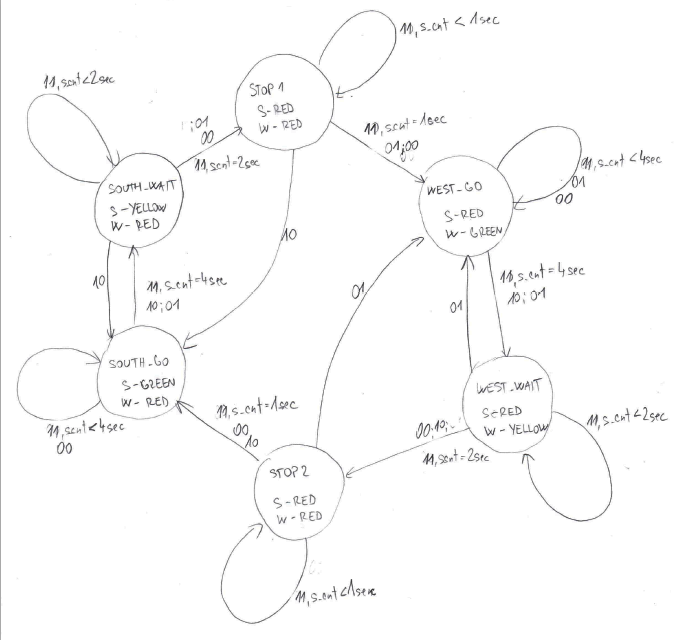

# Lab-06 counter
## 1. Preparation tasks 
### State table


### Figure with connection of RGB LEDs on Nexys A7 boerd and completed table with color settings


## 2. Traffic light controller
### State diagram

### Sequential process `p_traffic_fsm`
```vhdl
    p_traffic_fsm : process(clk)
    begin
        if rising_edge(clk) then
            if (reset = '1') then       -- Synchronous reset
                s_state <= STOP1 ;      -- Set initial state
                s_cnt   <= c_ZERO;      -- Clear all bits

            elsif (s_en = '1') then
                -- Every 250 ms, CASE checks the value of the s_state 
                -- variable and changes to the next state according 
                -- to the delay value.
                case s_state is

                    -- If the current state is STOP1, then wait 1 sec
                    -- and move to the next GO_WAIT state.
                    when STOP1 =>
                        -- Count up to c_DELAY_1SEC
                        if (s_cnt < c_DELAY_1SEC) then
                            s_cnt <= s_cnt + 1;
                        else
                            -- Move to the next state
                            s_state <= WEST_GO;
                            -- Reset local counter value
                            s_cnt   <= c_ZERO;
                        end if;

                    when WEST_GO =>
                        if (s_cnt < c_DELAY_4SEC) then
                            s_cnt <= s_cnt + 1;
                        else
                            s_state <= WEST_WAIT;
                            s_cnt   <= c_ZERO;
                        end if;
                        
                    when WEST_WAIT => 
                        if (s_cnt < c_DELAY_2SEC) then
                            s_cnt <= s_cnt + 1;
                        else
                            s_state <= STOP2;
                            s_cnt   <= c_ZERO;
                        end if;
                        
                    when STOP2 =>
                        if (s_cnt < c_DELAY_1SEC) then
                            s_cnt <= s_cnt + 1;
                        else
                            s_state <= SOUTH_GO;
                            s_cnt   <= c_ZERO;
                        end if;
                        
                    when SOUTH_GO =>
                        if (s_cnt < c_DELAY_4SEC) then
                            s_cnt <= s_cnt + 1;
                        else
                            s_state <= SOUTH_WAIT;
                            s_cnt   <= c_ZERO;
                        end if;
                        
                    when SOUTH_WAIT =>
                        if (s_cnt < c_DELAY_2SEC) then
                            s_cnt <= s_cnt + 1;
                        else
                            s_state <= STOP1;
                            s_cnt   <= c_ZERO;
                        end if;

                    -- It is a good programming practice to use the 
                    -- OTHERS clause, even if all CASE choices have 
                    -- been made. 
                    when others =>
                        s_state <= STOP1;

                end case;
            end if; -- Synchronous reset
        end if; -- Rising edge
    end process p_traffic_fsm;
```
### Combinatorial process `p_output_fsm`
```vhdl
    p_output_fsm : process(s_state)
    begin
        case s_state is
            when STOP1 =>
                south_o <= "100";   -- Red (RGB = 100)
                west_o  <= "100";   -- Red (RGB = 100)
                
            when WEST_GO =>
                south_o <= "100";   -- Red
                west_o  <= "010";   -- Green (RGB = 010)
                
            when WEST_WAIT =>
                south_o <= "100";   -- Red
                west_o  <= "110";   -- Yellow (RGB = 110)
                
            when STOP2 =>
                south_o <= "100";   -- Red
                west_o  <= "100";   -- Red  
                 
            when SOUTH_GO =>
                south_o <= "010";   -- Green
                west_o  <= "100";   -- Red
                
            when SOUTH_WAIT =>
                south_o <= "110";   -- Yellow
                west_o  <= "100";   -- Red

            when others =>
                south_o <= "100";   -- Red
                west_o  <= "100";   -- Red
        end case;
    end process p_output_fsm;
```
### Simulated time waveforms


## 3. Smart controller
### State table

### State diagram


### Process `p_smart_traffic_fsm`
```vhdl
    p_smart_traffic_fsm : process(clk)
    begin
        if rising_edge(clk) then
            if (reset = '1') then       -- Synchronous reset
                s_state <= STOP1;      -- Set initial state
                s_cnt   <= c_ZERO;      -- Clear all bits

            elsif (s_en = '1') then
                -- Every 250 ms, CASE checks the value of the s_state 
                -- variable and changes to the next state according 
                -- to the delay value.
                case s_state is

                    -- If the current state is STOP1, then wait 1 sec
                    -- and move to the next GO_WAIT state.
                    when STOP1 =>
                        if (is_car = "00" or is_car = "01") then
                            s_state <= WEST_GO;
                        elsif (is_car = "10") then
                            s_state <= SOUTH_GO;
                        else -- is_car = "11" -> same as traffic light controller
                             -- Count up to c_DELAY_1SEC
                             if (s_cnt < c_DELAY_1SEC) then
                                s_cnt <= s_cnt + 1;
                            else
                                -- Move to the next state
                                s_state <= WEST_GO;
                                -- Reset local counter value
                                s_cnt   <= c_ZERO;
                            end if;
                        end if;

                    when WEST_GO =>
                        if (is_car = "00" or is_car = "01") then
                            s_state <= WEST_GO;
                        elsif (is_car = "10") then
                            s_state <= WEST_WAIT;
                        else -- is_car = "11"
                            if (s_cnt < c_DELAY_4SEC) then
                                s_cnt <= s_cnt + 1;
                            else
                                s_state <= WEST_WAIT;
                                s_cnt   <= c_ZERO;
                            end if;
                        end if;                    
                        
                        
                    when WEST_WAIT => 
                        if (is_car = "00" or is_car = "10") then
                            s_state <= STOP2;
                        elsif (is_car = "01") then
                            s_state <= WEST_GO;
                        else -- is_car = "11"
                            if (s_cnt < c_DELAY_2SEC) then
                                s_cnt <= s_cnt + 1;
                            else
                                s_state <= STOP2;
                                s_cnt   <= c_ZERO;
                            end if;
                        end if;
                        
                    when STOP2 =>
                        if (is_car = "00" or is_car = "10") then
                            s_state <= SOUTH_GO;
                        elsif (is_car = "01") then
                            s_state <= WEST_GO;
                        else -- is_car = "11"
                            if (s_cnt < c_DELAY_1SEC) then
                                s_cnt <= s_cnt + 1;
                            else
                                s_state <= SOUTH_GO;
                                s_cnt   <= c_ZERO;
                            end if;
                        end if;
                        
                    when SOUTH_GO =>
                        if (is_car = "00" or is_car = "10") then
                            s_state <= SOUTH_GO;
                        elsif (is_car = "01") then
                            s_state <= SOUTH_WAIT;
                        else -- is_car = "11"
                            if (s_cnt < c_DELAY_4SEC) then
                                s_cnt <= s_cnt + 1;
                            else
                                s_state <= SOUTH_WAIT;
                                s_cnt   <= c_ZERO;
                            end if;
                        end if;
                        
                    when SOUTH_WAIT =>
                        if (is_car = "00" or is_car = "01") then
                            s_state <= STOP1;
                        elsif (is_car = "10") then
                            s_state <= SOUTH_GO;
                        else -- is_car = "11"
                            if (s_cnt < c_DELAY_2SEC) then
                                s_cnt <= s_cnt + 1;
                            else
                                s_state <= STOP1;
                                s_cnt   <= c_ZERO;
                            end if;
                        end if;

                    -- It is a good programming practice to use the 
                    -- OTHERS clause, even if all CASE choices have 
                    -- been made. 
                    when others =>
                        s_state <= STOP1;

                end case;
            end if; -- Synchronous reset
        end if; -- Rising edge
    end process p_smart_traffic_fsm;
```